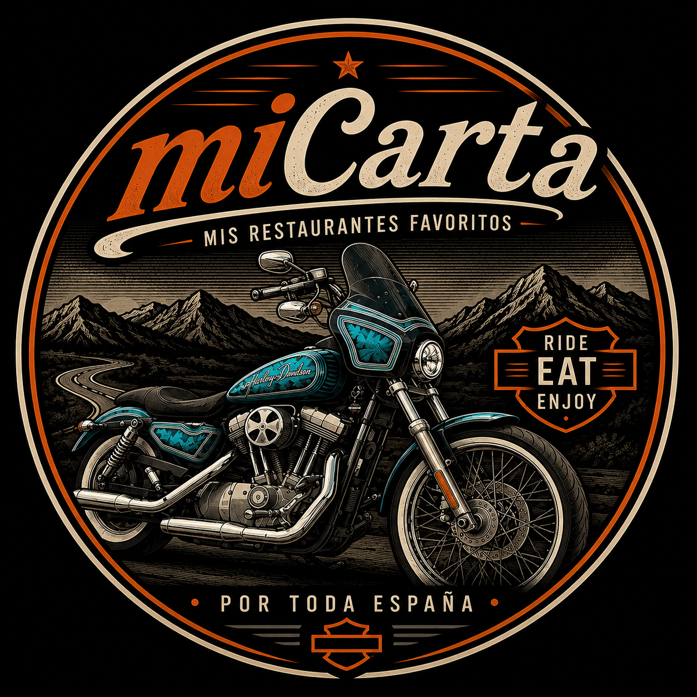

<p align="center">
  
</p>

<h1 align="center">miCarta</h1>

<p align="center">
  Cuaderno personal de restaurantes descubiertos por España en moto.<br/>
  Vista de cards · Vista de mapa · Sin backend · Solo tuyo.
</p>

---

## Qué es

miCarta es una web app privada para guardar y explorar los restaurantes favoritos encontrados durante rutas en moto por España. Cada sitio tiene su nota personal, tags, aviso si hace falta reservar, y enlace directo a Google Maps.

## Stack

- **React 18** + **TypeScript 5** strict
- **Vite 5** — build y dev server
- **Framer Motion 11** — animaciones y transiciones
- **React Leaflet 4** — mapa interactivo con OpenStreetMap
- **CSS puro** — diseño glassmorphic con aurora mesh gradient, sin UI library

## Desarrollo local

```bash
npm install
npm run dev
```

## Tests

```bash
npm test
```

## Build

```bash
npm run build
```

## Estructura

```
src/
├── components/
│   ├── CardGrid/       # Grid de cards con stagger entrance
│   ├── Header/         # Header glassmorphic con partículas teal
│   ├── MapView/        # Mapa con popups tipo card
│   ├── RestaurantCard/ # Card individual clickable → Google Maps
│   ├── SplashScreen/   # Intro con logo y animación letra a letra
│   └── ViewToggle/     # Cambio cards ↔ mapa
├── data/
│   └── restaurants.json  # Datos de los restaurantes
├── styles/
│   └── tokens.css        # Design tokens (colores, tipografía, espaciado)
└── types/
    └── Restaurant.ts     # Tipos TypeScript
```
